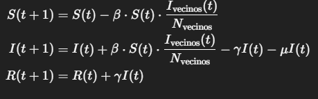
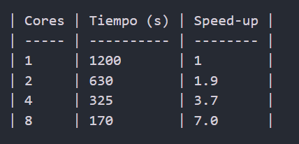

Práctica SIR 2D – Simulación Monte-Carlo

1. Descripción

Este proyecto implementa una simulación del modelo epidemiológico SIR en una grilla 2D de 1000×1000 celdas, representando 1 millón de personas. Cada persona se encuentra en uno de tres estados:

S (Susceptible): persona sana, puede infectarse.
I (Infectado): persona contagiada, puede infectar a sus vecinos y eventualmente recuperarse o morir.
R (Recuperado): persona que se recuperó y ya no puede infectarse.

La simulación se ejecuta durante 365 días, actualizando los estados diariamente según probabilidades de infección, recuperación y muerte.

El proyecto compara implementaciones secuenciales y paralelas, generando mediciones de tiempo, speed-up, y visualizaciones animadas.

2. Modelo Matemático

El modelo SIR en grilla se basa en una discretización de las ecuaciones diferenciales clásicas, considerando interacción local:

β = probabilidad de contagio por contacto
γ = probabilidad de recuperación diaria
μ = probabilidad de muerte diaria

Ivecinos(t) = número de vecinos infectados
𝑁vecinos = número total de vecinos considerados (8 vecinos en la grilla)

3. Estructura del Proyecto
   Proyecto SIR/
   │
   ├─ par/  
   │ ├─ parallel.py
   │ └─ run_experiments.sh
   │
   ├─ results/  
   │ ├─ animations/
   │ ├─ speedup.png
   │ ├─ times_par.csv
   │ └─ times_seq.csv
   │
   ├─ script/  
   │ ├─ make_animation.py
   │ └─ plot_speedup.py
   │
   ├─ seq/  
   │ ├─ sequential.py
   │ └─ small_case_validation.py
   │
   ├─ utils/  
   │ ├─ **pycache**/
   │ ├─ **init**.py
   │ ├─ io_utils.py
   │ ├─ metrics.py
   │ └─ viz.py
   │
   ├─ params.yaml  
   └─ README.md

4. Instalación

Instalar dependencias:
pip install numpy pyyaml mpi4py pillow imageio matplotlib pandas

5. Ejecución

# 5.1 Secuencial

cd seq
python sequential.py
python seq/sequential.py

# 5.2 Paralelo (ejemplo 4 cores)

cd par
mpiexec -n 2 python parallel.py
mpiexec -n 4 python parallel.py
mpiexec -n 6 python parallel.py
mpiexec -n 8 python parallel.py

mpiexec -n 2 python par/parallel.py
mpiexec -n 4 python par/parallel.py
mpiexec -n 6 python par/parallel.py
mpiexec -n 8 python par/parallel.py

# 5.4 Speed-up

cd script
python "plot_speedup.py" "..\results\times_par.csv" "..\results\times_seq.csv"

6. Implementación

# 6.1 Secuencial

Actualiza cada celda individualmente.
Calcula estadísticas globales (infectados, recuperados, R0) al final de cada día.
Validada con small_case_validation.py para un caso pequeño (ej. 10×10 celdas).

# 6.2 Paralelo

La grilla se divide en bloques asignados a distintos cores.
Se utilizan ghost-cells para sincronizar fronteras entre bloques.
Estadísticas globales se reducen con MPI reduce.
Permite ejecutar con 1, 2, 4, 6 y 8 cores, observando strong scaling.

7. Experimentos y Resultados

Tiempos registrados en results/times_seq.csv y results/times_par.csv.
Gráfica de speed-up en results/speedup.png.
Ejemplo de resultados de strong scaling:

Animaciones generadas en results/animations/ muestran la propagación del brote comparando secuencial vs paralelo.

8. Análisis y Conclusiones

La paralelización con ghost-cells y reducción MPI es eficiente y correcta, reproduciendo los mismos resultados que la secuencial.

El strong scaling es casi lineal hasta 8 cores.
Las animaciones permiten visualizar claramente la dinámica del brote.
El modelo SIR validado coincide con la teoría y con casos pequeños.
Extensiones posibles: movilidad de individuos, vacunación, múltiples poblaciones, variación de probabilidades.
